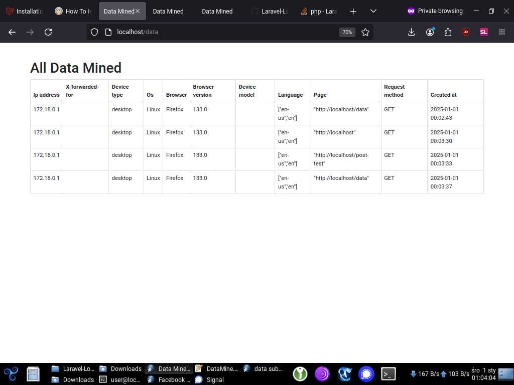

# Laravel Logs

## Project Overview

Laravel Logs is a simple logging system built with **Laravel** that captures and stores detailed user information, such as IP address, device type, browser details, and more. This data is then displayed on a dashboard for easy viewing and analysis.

The application collects various data points every time a user visits a page, including their:

- **IP Address**
- **Device Type**
- **Operating System**
- **Browser and Browser Version**
- **Device Model**
- **Language**
- **Request Method**
- **Page Visited**

This data is then stored in the database and can be viewed through a Laravel dashboard. A screenshot of the dashboard displaying this data can be seen below.

## Features

- **Data Mining:** Collects detailed information about each user visit.
- **Dashboard:** Displays the mined data in a tabular format.
- **Easy Setup:** Simple installation and configuration with Laravel.
- **Logging:** All user interactions, including IP, device, and browser information, are logged and stored in a database.

